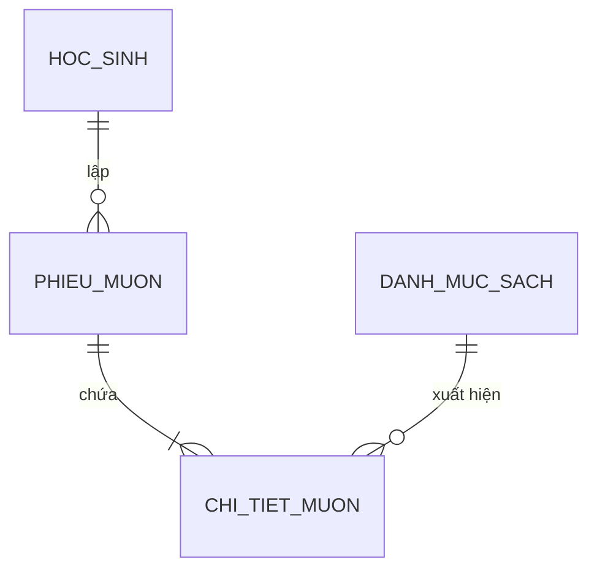

# 📐 SKILL: SCHEMA DESIGNER & SYSTEM THINKING WORKFLOW
> **Bộ Quy Tắc & Tư Duy Tổng Hợp Thiết Kế Schema Dữ Liệu Đỉnh Cao (UI - UX - DATABASE - DDD SYNERGY)**

---

## 🎯 TÔN CHỈ & NGUYÊN TẮC CỐT LÕI (CORE PHILOSOPHY)

```
+---------------------------------------------------------------------------------+
|                         TAM GIÁC VÀNG THIẾT KẾ HỆ THỐNG                         |
|                                                                                 |
|                      [ UI: Màn Hình Giao Diện Người Dùng ]                      |
|                                  ▲                                              |
|                                 / \                                             |
|                                /   \                                            |
|                               /     \                                           |
|                              v       v                                          |
|  [ UX: Hành Trình & Cỗ Máy Trạng Thái ] ◄---► [ DB: Sơ Đồ Cấu Trúc Schema ]     |
+---------------------------------------------------------------------------------+
```

1. **Code tuân theo Schema, Schema tuân theo UX, UX tuân theo Nghiệp vụ thực tế**: Đừng bao giờ áp đặt công nghệ trước khi hiểu luồng nghiệp vụ.
2. **Quy trình 3 Pha Thiết kế (3-Phase Design Protocol)**:
   - **Pha 1: Conceptual (Ý niệm)**: Nhận diện các Thực thể chính & Mối quan hệ bằng Tiếng Việt nông dân.
   - **Pha 2: Logical (Logic)**: Định nghĩa các cột thông tin, Khóa chính/ngoại, Ràng buộc dữ liệu không phụ thuộc vào CSDL nào.
   - **Pha 3: Physical (Vật lý)**: Chọn kiểu dữ liệu cụ thể (`VARCHAR`, `INT`, `DECIMAL`, `DATETIME`), Đánh chỉ mục `INDEX` và viết mã SQL chuẩn DDL.
3. **Nông dân hóa 100% Thuật ngữ nhưng Chuẩn hóa 100% Kiến trúc**: Giải thích bằng hình ảnh đời sống (ngăn tủ, thẻ căn cước, sổ báo giảng) nhưng áp dụng nguyên tắc kiến trúc phần mềm thế giới (DDD, 3NF, State Machine, RBAC, Audit Trail).

---

## 📚 TÀI LIỆU CHUYÊN SÂU TRONG THƯ MỤC REFERENCES

Agent hãy đọc các file chi tiết trong thư mục `references/` tùy theo yêu cầu cụ thể của người dùng:

| File | Mô tả nội dung | Khi nào cần đọc? |
| :--- | :--- | :--- |
| 📄 `ui-ux-db-mapping.md` | Ánh xạ phần tử UI/UX sang Cột/Bảng Schema & Cỗ máy Trạng thái | Khi chuyển từ bản thiết kế UI/UX sang DB |
| 📄 `audit-checklist.md` | Bộ 5 phép thử kiểm thử Schema & Bắt lỗi Edge cases | Trước khi chốt bản thiết kế Schema |
| 📄 `ddd-architectural-patterns.md` | Tư duy Domain-Driven Design (Entities, Value Objects, Aggregates) | Khi làm hệ thống lớn, phức tạp |
| 📄 `advanced-patterns-catalog.md` | Thư viện 12 Schema mẫu hoàn chỉnh (Giáo dục, Bán hàng, Booking...) | Khi cần tìm mẫu Schema thực tế |

---

## 🧠 BỘ 5 CÂU HỎI THẦN THÁNH DẪN DẮT (5-QUESTION FRAMEWORK)

Khi tiếp nhận bất kỳ ý tưởng website/app nào, Agent BẮT BUỘC dẫn dắt tư duy qua 5 câu hỏi:

1. **WHO / WHAT (Đối tượng)**: Hệ thống quản lý những Con người hay Cái gì? ➔ Xác định các **THỰC THỂ (Bảng chính / Master Data)**.
2. **DETAILS (Chi tiết)**: Mỗi đối tượng cần lưu trữ những Thông tin chi tiết gì? ➔ Xác định các **THUỘC TÍNH (Cột / Fields)**.
3. **IDENTITY (Định danh)**: Làm sao phân biệt 2 người trùng tên trùng họ? ➔ **KHÓA CHÍNH (🔑 Primary Key)**.
4. **RELATIONSHIPS (Liên kết)**: Những đối tượng tương tác với nhau thế nào? ➔ **KHÓA NGOẠI (🔗 Foreign Key)** & **MỐI QUAN HỆ (1-1, 1-Nhiều, Nhiều-Nhiều)**.
5. **ACTIONS (Hành động)**: Khi hành động xảy ra, dữ liệu gì mới sinh ra? ➔ **BẢNG PHỤ THUỘC / TRUNG GIAN (Transaction Table)**.

---

## 📐 LỘ TRÌNH 7 BƯỚC THIẾT KẾ SCHEMA PRODUCTION-READY

```
[BƯỚC 1: PHÂN TÍCH UX FLOW] ➔ [BƯỚC 2: BỘ 5 CÂU HỎI THẦN THÁNH] ➔ [BƯỚC 3: PHÂN LOẠI TAM DIỆN BẢNG]
                                                                        │
[BƯỚC 7: AUDIT CHECKLIST] ◄─ [BƯỚC 6: SECURE MULTI-TENANT] ◄─ [BƯỚC 5: STATE MACHINE] ◄─ [BƯỚC 4: 3NF & DENORMALIZATION]
```

### 📍 Bước 1: Phân tích UX Flow & Màn hình UI
Quy đổi từng màn hình UI sang bảng tương ứng (Data Table ➔ Bảng Master, Form nhập liệu ➔ Cột dữ liệu, Nút bấm ➔ Đổi trạng thái).

### 📍 Bước 2: Trả lời 5 Câu hỏi Thần thánh
Lập danh sách Thực thể, Thuộc tính và Khóa chính/ngoại.

### 📍 Bước 3: Phân loại Tam diện Bảng
*   **Bảng Độc Lập (Master Data)**: Học sinh, Giáo viên, Món ăn, Sách (Có sẵn từ đầu).
*   **Bảng Phụ Thuộc (Transaction Data)**: Đơn hàng, Phiếu mượn sách, Buổi điểm danh (Sinh ra khi có hành động).
*   **Bảng Nhật Ký (Audit Log)**: Lịch sử nạp tiền, Lịch sử đổi điểm, Log đăng nhập (Chỉ ghi read-only).

### 📍 Bước 4: 3NF & Phi chuẩn hóa Thực tế (Pragmatic Denormalization)
*   **Snapshot Giá & Biến động Dòng thời gian**: Lưu `don_gia_snapshot` ở bảng Chi tiết đơn hàng để khi menu đổi giá sau này, đơn hàng cũ vẫn giữ đúng giá thời điểm mua.
*   **Cached Totals**: Lưu sẵn `tong_tien` ở bảng cha để UI render tức thì (< 10ms).

### 📍 Bước 5: Cỗ máy Trạng thái (State Machine Pattern)
Thiết kế cột `trang_thai` theo chu kỳ vòng đời:
`DRAFT ➔ PENDING ➔ APPROVED/PAID ➔ COMPLETED ➔ CANCELLED/REFUNDED`.

### 📍 Bước 6: Phân quyền & Đa trường học (RBAC & Multi-Tenant)
*   Thêm cột `tenant_id` / `ma_truong` để bảo vệ dữ liệu giữa các trường học/chi nhánh.
*   Thêm cột `created_by` để xác định ai tạo dòng dữ liệu.

### 📍 Bước 7: Audit Trail & Soft Delete
Mọi bảng production BẮT BUỘC có 3 cột: `created_at`, `updated_at`, `is_deleted` (Soft Delete).

---

## 🖼️ QUY CHUẨN XUẤT ĐẦU RA (OUTPUT PROTOCOL)

Agent BẮT BUỘC trả về đầy đủ 4 dạng đầu ra:
1. **Dạng 1: Tiếng Việt Nông Dân**: Giải thích ví dụ thực tế gần gũi.
2. **Dạng 2: Sơ Đồ Đồ Họa Đa Sắc (Visual Color Cards)**: Dùng các thẻ màu bo góc (Blue, Purple, Green, Amber) có icon 🔑.
3. **Dạng 3: Mã Sơ đồ Mermaid ERD**:

4. **Dạng 4: Mã nguồn SQL DDL Chuẩn Production**: Cung cấp mã `CREATE TABLE`, `PRIMARY KEY`, `FOREIGN KEY`, `INDEX` và `COMMENT`.
